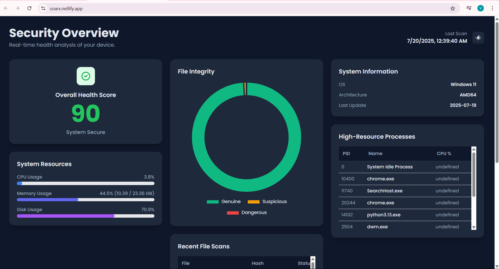
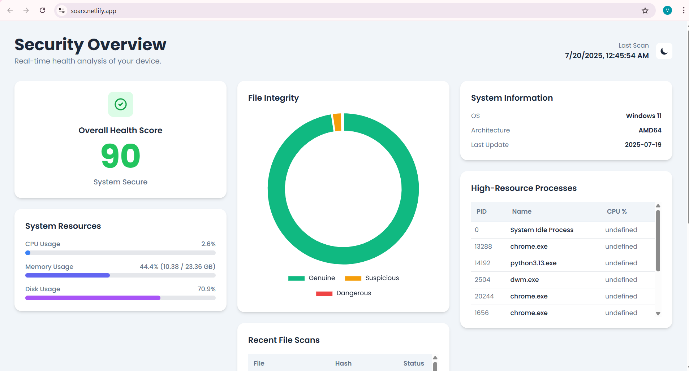
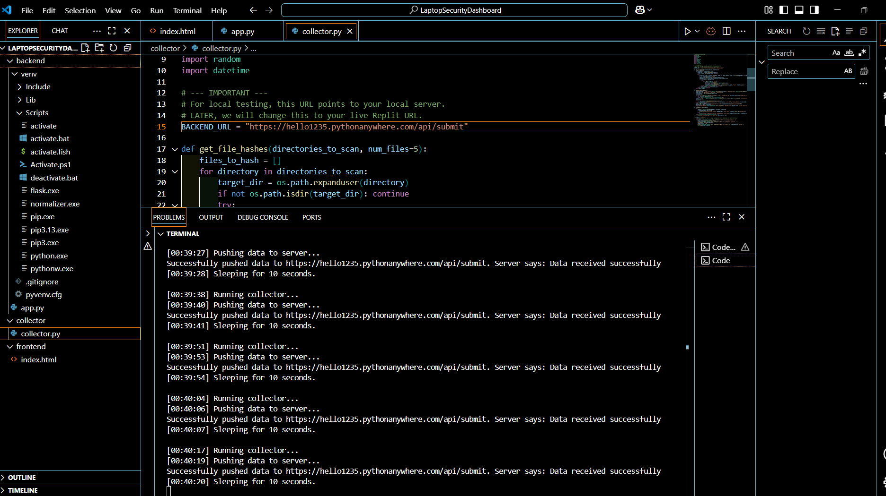

# 💻 Laptop Security & Health Dashboard

A **full-stack web application** that provides a **real-time security and health overview** of your laptop.  
It features a **Python-based data collector**, a **Flask backend**, and a **modern, responsive frontend** for clear, live monitoring.

---

## 🚀 Live Demo

- **Live Dashboard:** [https://soarx.netlify.app/](https://soarx.netlify.app/)  
- **Backend API Host:** [https://hello1235.pythonanywhere.com/](https://hello1235.pythonanywhere.com/)

---

## 📸 Screenshots

**Light Mode**



**Dark Mode**



**Live Code Running**



---

## ✅ Features

| Feature                    | Status | Description                                                    |
|----------------------------|--------|----------------------------------------------------------------|
| **Live Health Score**      | ✅     | An overall score calculated from real-time system metrics.     |
| **Real-time Resources**    | ✅     | Live monitoring of CPU, Memory, and Disk usage.                |
| **File Integrity Scan**    | ✅     | Hashes files from user directories to detect changes (simulated). |
| **High-Resource Processes**| ✅     | Lists top 10 most resource-intensive processes.                |
| **Active Network Connections** | ✅ | Shows active TCP/UDP connections.                              |
| **Detailed System Info**   | ✅     | Displays OS, architecture, and version details.                |
| **Light & Dark Mode**      | ✅     | Modern UI with theme toggle that saves preference.             |

---

## 🗂️ System Architecture

```plaintext
┌─────────────────┐      ┌───────────────────────────────────┐      ┌───────────────────────────┐
│                 │      │                                   │      │                           │
│  Target Laptop  │      │    PythonAnywhere Cloud Server    │      │      Netlify Frontend     │
│ (collector.py)  │      │            (app.py)               │      │        (index.html)       │
│                 │      │                                   │      │                           │
└─────────────────┘      └───────────────────────────────────┘      └───────────────────────────┘
        │                            ▲      │                            ▲
        │                            │      │                            │
        └────(1) Pushes JSON data────┘      └─────(2) Serves JSON────────┘
                   via POST                               via GET
git clone [YOUR GITHUB REPO URL]
cd LaptopSecurityDashboard

cd backend

# Create and activate a virtual environment
python -m venv venv

# On Windows
.\venv\Scripts\activate

# On macOS/Linux
source venv/bin/activate

# Install dependencies
pip install Flask Flask-Cors requests psutil

python backend/app.py

# Open a new terminal, activate the venv if needed
python collector/collector.py


MIT License

